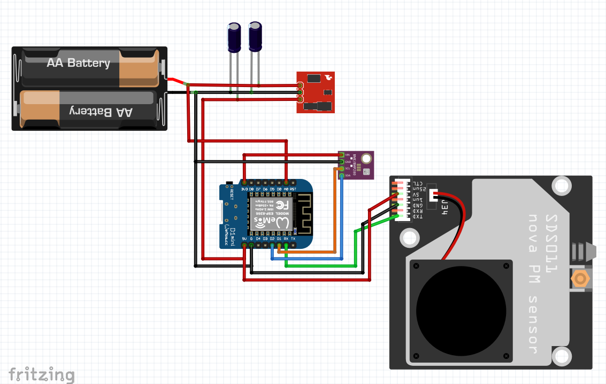
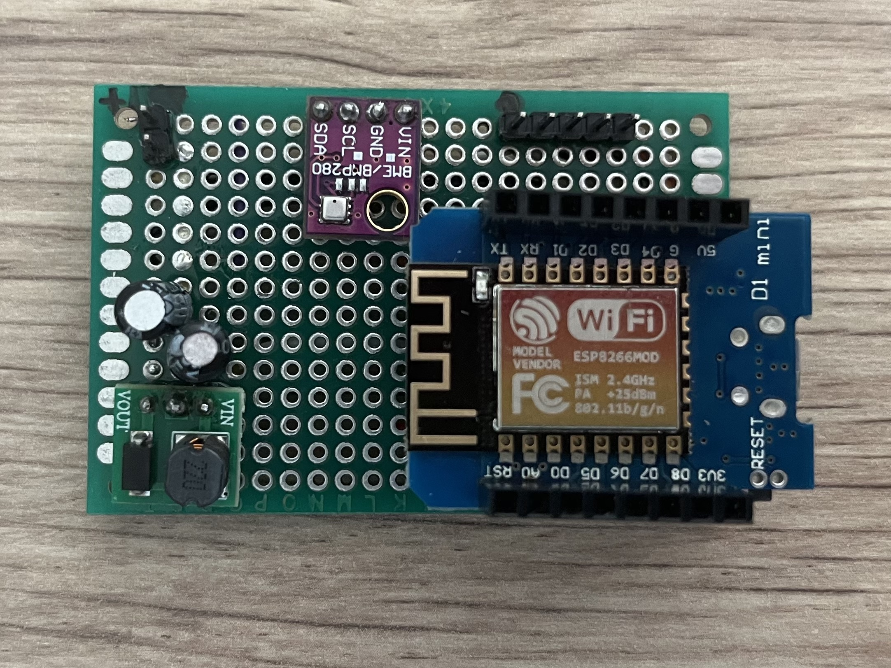
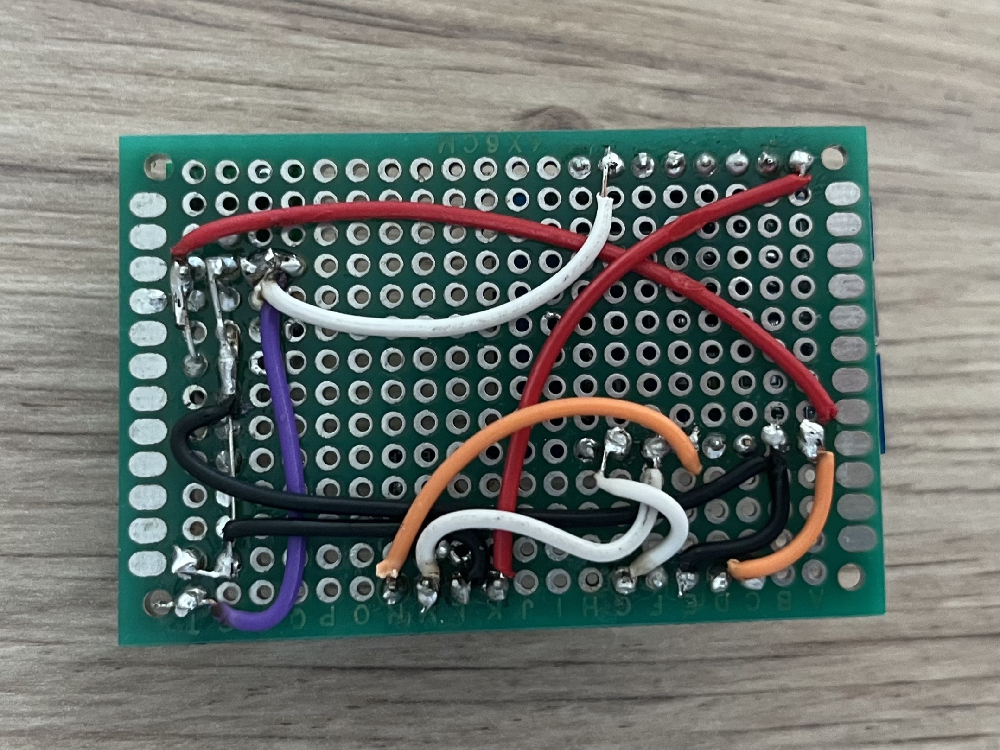
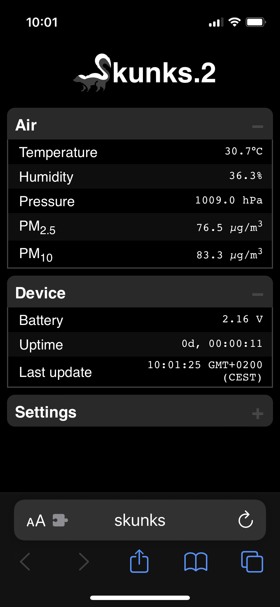

# Skunks.2

Skunks (Polish for Skunk) is a second iteration of small, portable, battery powered air quality meter aimed for use in home projects and in every place where affordable air quality meter might be useful. 

It is designed to be affordable and easy to make from over-the-counter parts.

For historic reasons, first iteration is available here: https://github.com/m-stefanski/skunks

## Capabilities

Skunks can measure following air parameters:

* PM 2,5
* PM 10
* Temperature
* Humidity
* Pressure

Results are available as a website  (http://skunks/) presented when user connects to a WiFi network the device is broadcasting. It is also planned to allow configuring Skunks to connect to any available 2.4 GHz WiFi network and view its results there.

## Hardware

* [WeMOS D1 mini](https://www.wemos.cc/en/latest/d1/d1_mini.html) - for CPU / Memory / IO and WiFi capabilities
* [SDS011](http://www.inovafitness.com/en/a/chanpinzhongxin/95.html) -  dust sensor from Nova Fitness Co., Ltd.
* [BME280](https://www.bosch-sensortec.com/products/environmental-sensors/humidity-sensors-bme280/) - temprerature, humidity and air pressure sensor from BOSH
* Generic no-name step-up voltage converter allowing it to squeeze 5V from battery source
## Project structure

* [src](/src) contains main program loop in C
* [src_www](/src_www) contains raw web resources
* [include](/include) contains headers and pre-compiled web resources, most of code logic is there
* [datasheets](/datasheets) contains Data sheets for used components
## Building and flashing

0. *Warning:* for code upload, SDS011 has to be disconnected as it utilizes the same pin (RX) on D1 as programming process uses

1. Install Platform.io plugin on vscode, project setting will be automatically detected

2. If you made any changes to `src_www` contents, converted headers need to be updated

```
python3 ./www_to_h.py
```

3. From `General` task category select `Upload`

## Schematics and photos

Schematic overview of electrical connections:



Live implementation:





Web UI:

